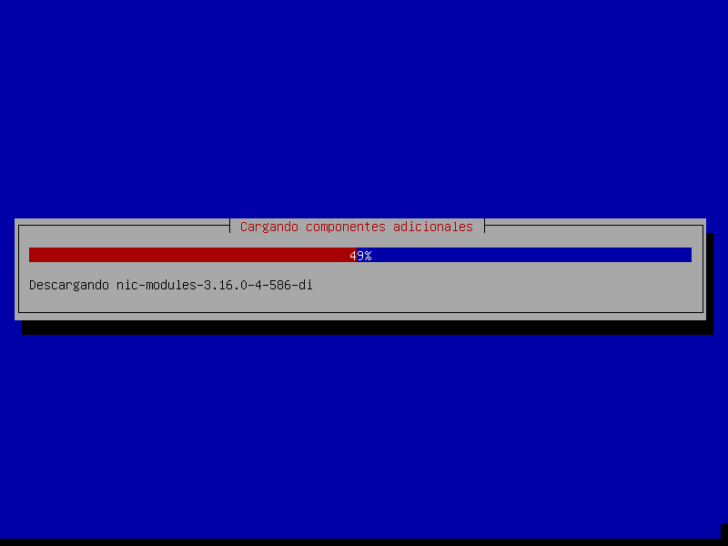

# SERVIDORES WEB DE ALTAS PRESTACIONES


## Ejercicios Tema 4


### **Hugo Maldonado Cózar**

# <a></a>

### Ejercicio 1
#### Buscar información sobre cuánto costaría en la actualidad un mainframe. Comparar precio y potencia entre esa máquina y una granja web de unas prestaciones similares.

Según este [enlace](https://www.quora.com/How-much-does-an-IBM-mainframe-cost), dicen que para obtener mayor información y precios más exactos es mejor contactar con los fabricantes, pero que un mainframe de IBM puede costar al rededor de 75.000$.

Es complicado obtener información de los fabricantes de las granjas webs y mainframes, ya que no están puestos de forma pública si no que los negocian con las grandes empresas que los solicitan, por lo que la comparación es prácticamente imposible de hacer.

# <a></a>
### Ejercicio 2
#### Buscar información sobre precio y características de balanceadores hardware específicos. Compara las prestaciones que ofrecen unos y otros.

Los balanceadores de carga hardware más famosos son:

- Cisco Load Balancer

- Barracuda Load Balancer

Por lo general, ambos realizan un balance de carga de 4 y 7 capas, ofrecen monitorización constante, también pueden servir como balanceadores globales, seguridad a través del cifrado SSL, almacenamiento en caché HTTP, compresión de datos, direccionamiento de contenido estático, protección frente a ataques de aplicaciones y DDOS, prevención frente a pérdidas de datos, actualizaciones de seguridad automáticas...

Barracuda da más información en su web sobre sus productos más específicos, así que voy a realizar la comparación con 3 modelos de sus balanceadores de carga, en concreto con **Barracuda Load Balancer ADC 842**, **Barracuda Load Balancer ADC 642** y **Barracuda Load Balancer ADC 440** que son de distintas gamas y se puede apreciar mayor diferencia.

Ellos te ofrecen una comparación entre sus productos que nos da muchísima información al respecto, podemos verlo [aquí](https://www.barracuda.com/products/loadbalancer/models/compare/1?models=842,642,440)

# <a></a>
### Ejercicio 3
#### Buscar información sobre los métodos de balanceo que implementan los dispositivos recogidos en el ejercicio 4.2.

Ninguno de estos balanceadores hardware, en su página web, especifica qué métodos exactos son los que usan para balanceo, pero sí que pueden configurarse para repartir las peticiones con bastantes algoritmos de distribución de la carga, seguro que los vistos en la asignatura y otros propios seguramente.

# <a></a>
### Ejercicio 4
#### Instala y configura en una máquina virtual el balanceador ZenLoadBalancer.





Una vez instalado, podemos acceder al panel de administración que nos ofrece a través de la siguiente dirección: https://<zenlb_ip_address>:444


Una vez dentro tenemos muchas opciones de configuración y monitorización.

Como no tengo las máquinas virtuales de las prácticas ya en el equipo, no puedo configurarlo exactamente, pero es una interfaz muy intuitiva y el proceso es sencillo, habiendo muchos tutoriales del proceso.

# <a></a>
### Ejercicio 5
#### Probar las diferentes maneras de redirección HTTP. ¿Cuál es adecuada y cuál no lo es para hacer balanceo de carga global? ¿Por qué?

- **Redirección 301**. Redirección permanente. Esta redirección es útil en migraciones de sitios web para evitar pérdidas de enlaces en el servidor antiguo e incluso perder posicionamiento en los buscadores.

- **Redirección 302**. Redirección temporal. Es útil cuando se está realizando mantenimiento en nuestro servidor y queremos que durante un periodo de tiempo sea otro servidor el que sirva las peticiones recibidas.

En mi opinión, es mejor la **302**, ya que sería posible redirigir a más de un servidor a la vez (con la 301 no he encontrado esa posibilidad). Además, con ésta, los navegadores no indexarían la redirección como una nueva, sino como una redirección en sí, pudiendose cambiar por otra distinta con una nueva llamada.

# <a></a>
### Ejercicio 6
#### Buscar información sobre los bloques de IP para los distintos países o continentes. Implementar en JavaScript o PHP la detección de la zona desde donde se conecta un usuario.

Las direcciones IP son repartidas geolocalizadamente por bloques entre los distintos continentes y países.

Hay algunas bases de datos que identifican el rango de la IP con su continente y país al que pertecene. 

Estas bases de datos son las que se suelene consultar a la hora de hacer peticiones a una web que identifica IPs, por ejemplo cuando detectamos anomalías en nuestro servidor, podemos consultar desde dónde se están produciendo gracias a estas bases de datos.

Aunque la mayoría son de pago, **GeoLite2** sí es gratuita y se puede consultar.

Tal y como podemos observar en [**W3School**](https://www.w3schools.com/html/html5_geolocation.asp), con HTML5 se ha facilitado la geolocalización, haciéndolo como una API estándar que los navegadores deben implementar.

Cabe decir que algunos navegadores sólo lo permiten en contextos seguros **HTTSP**.

El script Javascript para conseguir las coordenadas geográficas de un usuario sería:

```js
var x = document.getElementById("demo");
function getLocation() {
    if (navigator.geolocation) {
        navigator.geolocation.getCurrentPosition(showPosition);
    } else {
        x.innerHTML = "Geolocation is not supported by this browser.";
    }
}
function showPosition(position) {
    x.innerHTML = "Latitude: " + position.coords.latitude + 
    "<br>Longitude: " + position.coords.longitude; 
}
```

Con eso tenemos la latitud y longitud, y haciendo uso por ejemplo de la API de Google Maps, o alguna otra, ya podríamos tener información que nos pueda interesar más.

# <a></a>
### Ejercicio 7
#### Buscar información sobre métodos y herramientas para implementar GSLB.

**GSLB** se basa en técnicas como 

- Redirección de DNS
- Redirección HTTP
- RHI 
- VPN
- ...

Suele configurarse de 2 formas distintas:

- **active-active**. Las solicitudes de los usuarios se reparten por los distintos centros de datos existentes y en estado activo.

- **active-stanby**. Las solicitudes de los usuarios van siempre al mismo centro de datos, menos en los casos de caída o desastre, en el que se tiene al menos 1 otro en espera, que pasamos a utilizar.

Podemos utilizar software que proporcione Equilibrio de carga también para dotar de funcionalidades al GSLB o como extensión u apoyo.

Existen en internet muchas guías muy detalladas para implementar GSLB con **NetScaler** o incluso **Nginx**.