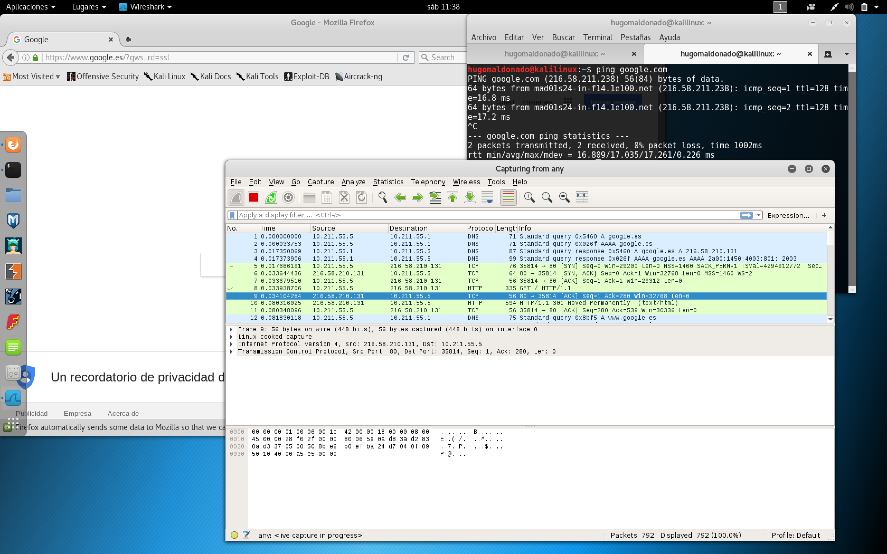

# SERVIDORES WEB DE ALTAS PRESTACIONES

## Ejercicios Tema 5

### **Hugo Maldonado Cózar**

# 

### Ejercicio 1
#### Buscar información sobre cómo calcular el número de conexiones por segundo.

La forma más sencilla de obtener el número de conexiones por segundo sería utilizando software de evaluación del servidor web, es decir, algún tipo de Benchmark que nos indique esa información, como Apache Benchmark.

La forma más simple de hacerlo con este tipo de software, sería incrementando el número de peticiones por segundo hacia el servidor web hasta que se produzcan fallos en nuestro servidor de respuesta en las solicitudes y así podríamos obtener cuál es el número máximo de conexiones por segundo que soportaría nuestro servidor.

También tenemos otras herramientas con las que podemos obtener dicha información como **apache2ctl**, **netstat**, **iptstate**, módulos específicos de Apache y Nginx...

# 
### Ejercicio 2
#### Revisar los análisis de tráfico que se ofrecen en: http://bit.ly/1g0dkKj
#### Instalar wireshark y observar cómo fluye el tráfico de red en uno de los servidores web mientras se le hacen peticiones HTTP.

Debido a que por haber terminado ya las prácticas no tengo las máquinas virtuales, he hecho la petición sobre [Google](https://www.google.es/?gws_rd=ssl).

En la terminal a la derecha, se ve que le he hecho un PING a Google para conocer su IP lo primero.

Luego he puesto el Wireshark a monitorizar y he hecho la petición a la URL de Google a través de Firefox.

En la imagen del Wireshark, en verde, se ve la conexión TCP que se ha creado al hacer la petición con el navegador. Entre otros datos podemos ver la IP destino y origen, en qué instante de tiempo se ha producido, el triple Handshake que produce una conexión TCP...

# 
### Ejercicio 3
#### Buscar información sobre características, disponibilidad para diversos SO, etc de herramientas para monitorizar las prestaciones de un servidor.

Algunos del software más representativo para monitorización de las prestaciones de un servidor son:

- **Nagios**. Puede monitorizar los servicios de red y recursos hardware. No permite el acceso remoto a la información, sistema de notificaciones, comprobación de la paralelización de los servicios e información a tiempo real sobre los datos entre otras.

- **Ganglia**. Esta pensado para monitorización de servidores de alto rendimiento (cluster normalmente). Es un software muy ligero que aprovecha mucho la concurrencia para la obtención de la información.

- **AWStats**. Este monitor es multiplataforma, es decir, funciona tanto en Windows, macOS y Linux. La información nos la puede generar con informes gráficos (en HTML) aparte de los típicos logs. Monitoriza todo lo que pasa en el servidor.

- **Munin**. Tenemos una amplia colección de información que puede ofrecernos, debido principalmente a su extensibilidad gracias a los plugins que se le pueden instalar encima.