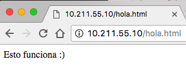

# SERVIDORES WEB DE ALTAS PRESTACIONES


## Práctica 1


### **Hugo Maldonado Cózar**

# <a></a>

Una vez creadas las máquinas virtuales, instalado `Ubuntu Server 16.10` y actualizadas con las últimas versiones del software inicial instalado, en ambas tenemos la siguiente configuración:


|        Nombre         |      IP        |
|:---------------------:|:--------------:|
| Ubuntu Server SWAP 1  |  10.211.55.9   |
| Ubuntu Server SWAP 2  |  10.255.11.10  |


Al estar usando el motor de virtualización `Parallel Desktop` de Mac OS X, estas máquinas pueden verse entre sí sin ningún tipo de configuración adicional:

```
hugomaldonado@ubuntu-server-swap-2:~$ ping 10.211.55.9
PING 10.211.55.9 (10.211.55.9) 56(84) bytes of data.
64 bytes from 10.211.55.9: icmp_seq=1 ttl=64 time=0.318 ms
64 bytes from 10.211.55.9: icmp_seq=2 ttl=64 time=0.276 ms
^C
--- 10.211.55.9 ping statistics ---
2 packets transmitted, 2 received, 0% packet loss, time 1019ms
rtt min/avg/max/mdev = 0.276/0.297/0.318/0.021 ms
```

```
hugomaldonado@ubuntu-server-swap-1:~$ ping 10.211.55.10
PING 10.211.55.10 (10.211.55.10) 56(84) bytes of data.
64 bytes from 10.211.55.10: icmp_seq=1 ttl=64 time=0.205 ms
64 bytes from 10.211.55.10: icmp_seq=2 ttl=64 time=0.312 ms
64 bytes from 10.211.55.10: icmp_seq=3 ttl=64 time=0.255 ms
64 bytes from 10.211.55.10: icmp_seq=4 ttl=64 time=0.237 ms
64 bytes from 10.211.55.10: icmp_seq=5 ttl=64 time=0.292 ms
^C
--- 10.211.55.10 ping statistics ---
5 packets transmitted, 5 received, 0% packet loss, time 4089ms
rtt min/avg/max/mdev = 0.205/0.260/0.312/0.039 ms
```

Como en ambas el usuario que he creado durante el arranque ya es usuario administrador, no es necesario activar el usuario `root` ya que para todas esas tareas podemos usar el usuario creado a través de la orden `sudo`. Podemos comprobarlo:

```
$ cat /etc/group
...
adm:x:4:syslog,hugomaldonado
...
```

Con esto podemos ver que nuestro usuario (`hugomaldonado`) está en el grupo `adm` que es el de los administradores.

Si ahora mostramos el archivo `sudoers` que es en que se definen los usuarios (o grupos de usuarios) que tienen acceso `root` a la máquina:

```
$ sudo cat /etc/sudoers
#
# This file MUST be edited with the 'visudo' command as root.
#
# Please consider adding local content in /etc/sudoers.d/ instead of
# directly modifying this file.
#
# See the man page for details on how to write a sudoers file.
#
Defaults	env_reset
Defaults	mail_badpass
Defaults	secure_path="/usr/local/sbin:/usr/local/bin:/usr/sbin:/usr/bin:/sbin:/bin:/snap/bin"

# Host alias specification

# User alias specification

# Cmnd alias specification

# User privilege specification
root	ALL=(ALL:ALL) ALL

# Members of the admin group may gain root privileges
%admin ALL=(ALL) ALL

# Allow members of group sudo to execute any command
%sudo	ALL=(ALL:ALL) ALL

# See sudoers(5) for more information on "#include" directives:

#includedir /etc/sudoers.d
```

Las líneas que más nos interesa es la siguiente:

```
# Members of the admin group may gain root privileges
%admin ALL=(ALL) ALL

# Allow members of group sudo to execute any command
%sudo	ALL=(ALL:ALL) ALL
```

Podemos ver que tanto los usuarios del grupo `admin` como los del grupo `sudo` tienen acceso completo al sistema.

Además, podemos ejecutar cualquier comando con la orden `sudo` predecedida e introduciendo la contraseña que le asignamos al usuario cuando lo creamos (como hemos visto más arriba al mostrar el archivo `sudoers`).

## Comprobación de que Apache está corriendo

Versión de `Apache` en ambas máquinas:

```
hugomaldonado@ubuntu-server-swap-1:~$ apache2 -v
Server version: Apache/2.4.18 (Ubuntu)
Server built:   2016-07-18T18:32:02
```

```
hugomaldonado@ubuntu-server-swap-2:~$ apache2 -v
Server version: Apache/2.4.18 (Ubuntu)
Server built:   2016-07-18T18:32:02
```

Procesos que está usando `Apache` en ambas máquina:

```
hugomaldonado@ubuntu-server-swap-1:~$ ps aux | grep apache
root      1322  0.0  2.4 260224 25112 ?        Ss   16:24   0:00 /usr/sbin/apache2 -k start
www-data  1326  0.0  0.7 260248  7760 ?        S    16:24   0:00 /usr/sbin/apache2 -k start
www-data  1327  0.0  0.7 260248  7760 ?        S    16:24   0:00 /usr/sbin/apache2 -k start
www-data  1328  0.0  0.7 260248  7760 ?        S    16:24   0:00 /usr/sbin/apache2 -k start
www-data  1329  0.0  0.7 260248  7760 ?        S    16:24   0:00 /usr/sbin/apache2 -k start
www-data  1330  0.0  0.7 260248  7760 ?        S    16:24   0:00 /usr/sbin/apache2 -k start
hugomal+  1510  0.0  0.0  16764   980 pts/0    R+   16:29   0:00 grep --color=auto apache

```

```
hugomaldonado@ubuntu-server-swap-2:~$ ps aux | grep apache
root      1334  0.0  2.4 260224 25188 ?        Ss   16:25   0:00 /usr/sbin/apache2 -k start
www-data  1338  0.0  0.7 260248  7864 ?        S    16:25   0:00 /usr/sbin/apache2 -k start
www-data  1339  0.0  0.7 260248  7864 ?        S    16:25   0:00 /usr/sbin/apache2 -k start
www-data  1340  0.0  0.7 260248  7864 ?        S    16:25   0:00 /usr/sbin/apache2 -k start
www-data  1341  0.0  0.7 260248  7864 ?        S    16:25   0:00 /usr/sbin/apache2 -k start
www-data  1342  0.0  0.7 260248  7864 ?        S    16:25   0:00 /usr/sbin/apache2 -k start
hugomal+  1589  0.0  0.1  16764  1028 pts/0    R+   16:28   0:00 grep --color=auto apache
```

Ahora vamos a crear la página de prueba mencinada en el guión en una de las máquinas y vamos a acceder tanto desde la máquina anfitrión (a través del navegador) como desde la otra máquina configurada (a través de `curl`):

```
hugomaldonado@ubuntu-server-swap-2:~$ sudo nano /var/www/html/hola.html

<HTML>
<BODY>
        Esto funciona :)
</BODY>
</HTML>
```

Máquina anfitrión usando el navegador:



La otra máquina virtual usando `curl`:

```
hugomaldonado@ubuntu-server-swap-1:~$ curl 10.211.55.10/hola.html
<HTML>
<BODY>
	Esto funciona :) 
</BODY>
</HTML>
```