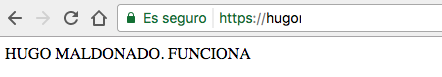
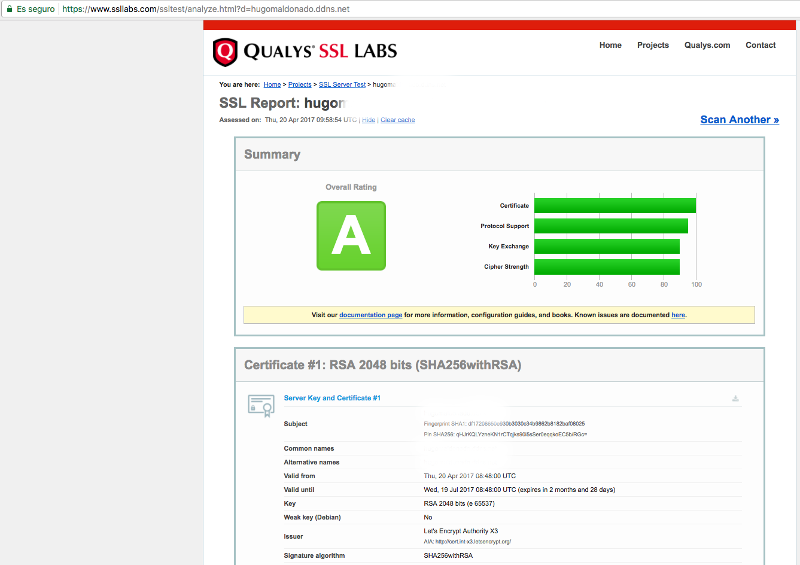
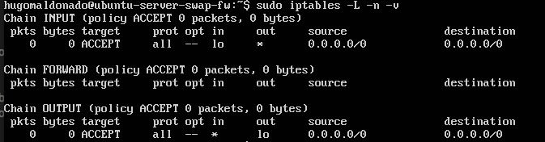

# SERVIDORES WEB DE ALTAS PRESTACIONES


## Práctica 4


### **Hugo Maldonado Cózar**

# <a></a>

Después de la configuración de la práctica 3 y de la instalación y configuración de la máquina que vamos a usar como cortafuegos tenemos el siguiente esquema:

|        Nombre         |      IP        |
|:---------------------:|:--------------:|
| Ubuntu Server SWAP 1  |  10.211.55.9   |
| Ubuntu Server SWAP 2  |  10.211.55.10  |
| Ubuntu Server SWAP LB |  10.211.55.11  |
| Ubuntu Server SWAP FW |  10.211.55.12  |

## Instalación y configuración de un certificado SSL de Let's Encrypt

Al entrar en la [web de Let's Encrypt](https://letsencrypt.org/getting-started/) y observar cómo empezar, nos comenta que si tenemos acceso `SSH` al dominio (en nuestro caso por supuesto) los mejor es usar el cliente [Certbot](https://certbot.eff.org/). Ahí vemos que debemos seguir los siguientes pasos:

Añadir el repositorio de Certbot:

```
$ sudo add-apt-repository ppa:certbot/certbot
```

Instalar el software:

```
$ sudo apt-get install python-certbot-apache
```

Ejecutar Cerbot para conseguir el certificado y configurar Apache:

```
$ sudo certbot --apache
Saving debug log to /var/log/letsencrypt/letsencrypt.log
No names were found in your configuration files. Please enter in your domain
name(s) (comma and/or space separated)  (Enter 'c' to cancel):<domain>
Starting new HTTPS connection (1): acme-v01.api.letsencrypt.org
Obtaining a new certificate
Performing the following challenges:
tls-sni-01 challenge for <domain>
Enabled Apache socache_shmcb module
Enabled Apache ssl module
Waiting for verification...
Cleaning up challenges
Generating key (2048 bits): /etc/letsencrypt/keys/0000_key-certbot.pem
Creating CSR: /etc/letsencrypt/csr/0000_csr-certbot.pem
Created an SSL vhost at /etc/apache2/sites-available/000-default-le-ssl.conf
Enabled Apache socache_shmcb module
Enabled Apache ssl module
Deploying Certificate to VirtualHost /etc/apache2/sites-available/000-default-le-ssl.conf
Enabling available site: /etc/apache2/sites-available/000-default-le-ssl.conf

Please choose whether HTTPS access is required or optional.
-------------------------------------------------------------------------------
1: Easy - Allow both HTTP and HTTPS access to these sites
2: Secure - Make all requests redirect to secure HTTPS access
-------------------------------------------------------------------------------
Select the appropriate number [1-2] then [enter] (press 'c' to cancel): 2

-------------------------------------------------------------------------------
Congratulations! You have successfully enabled https://<domain>

You should test your configuration at:
https://www.ssllabs.com/ssltest/analyze.html?d=<domain>
-------------------------------------------------------------------------------

IMPORTANT NOTES:
 - Congratulations! Your certificate and chain have been saved at
   /etc/letsencrypt/live/<domain>/fullchain.pem. Your
   cert will expire on 2017-07-19. To obtain a new or tweaked version
   of this certificate in the future, simply run certbot again with
   the "certonly" option. To non-interactively renew *all* of your
   certificates, run "certbot renew"
 - If you like Certbot, please consider supporting our work by:

   Donating to ISRG / Let's Encrypt:   https://letsencrypt.org/donate
   Donating to EFF:                    https://eff.org/donate-le
```

Para que funcione he tenido que configuarlo en un servidor que tengo, con un nombre de dominio dinámico (DDNS). Por temas de seguridad he omitido el nombre de dominio estableciéndolo como `<domain>`.

He habilitado el modo 'Secure' para que funcione sólo como servidor `HTTPS` para manejar correctamente la seguridad al tratarse de un servidor real.





## Instalación y configuración del cortafuegos.

Lo primero que vamos a hacer es conocer en qué estado está `IPTABLES` en nuestra máquina cortafuegos:

```
hugomaldonado@ubuntu-server-swap-fw:~$ sudo iptables -L -n -v
Chain INPUT (policy ACCEPT 64 packets, 4568 bytes)
 pkts bytes target     prot opt in     out     source               destination         

Chain FORWARD (policy ACCEPT 0 packets, 0 bytes)
 pkts bytes target     prot opt in     out     source               destination         

Chain OUTPUT (policy ACCEPT 34 packets, 3952 bytes)
 pkts bytes target     prot opt in     out     source               destination  
```

Como podemos observar, no tiene nada configurado, está tal viene recién instalado.

Lo primero que vamos a hacer es establecer por defecto que bloquee todo el tráfico:

```
hugomaldonado@ubuntu-server-swap-fw:~$ sudo iptables -P INPUT DROP

hugomaldonado@ubuntu-server-swap-fw:~$ sudo iptables -P OUTPUT DROP

hugomaldonado@ubuntu-server-swap-fw:~$ sudo iptables -P FORWARD DROP
```

Esto es importante hacerlo directamente en la máquina, ya que automáticamente bloquea la conexión `SSH` o bien especificar primero las reglas para permitir la conexión `SSH`. Yo lo he hecho directamente en la máquina virtual.

Después de este bloqueo `IPTABLES` se nos queda en este estado:

```
hugomaldonado@ubuntu-server-swap-fw:~$ sudo iptables -L -n -v
Chain INPUT (policy DROP 0 packets, 0 bytes)
 pkts bytes target     prot opt in     out     source               destination         

Chain FORWARD (policy DROP 0 packets, 0 bytes)
 pkts bytes target     prot opt in     out     source               destination         

Chain OUTPUT (policy DROP 0 packets, 0 bytes)
 pkts bytes target     prot opt in     out     source               destination 
```

Lo siguiente que vamos a establecer es permitir cualquier acceso desde la propia máquina:

```
hugomaldonado@ubuntu-server-swap-fw:~$ sudo iptables -A INPUT -i lo -j ACCEPT

hugomaldonado@ubuntu-server-swap-fw:~$ sudo iptables -A OUTPUT -o lo -j ACCEPT
```

Y se nos queda en el siguiente estado:



Ahora vamos a permitir el acceso por `SSH` en el puerto por defecto (22):

```
hugomaldonado@ubuntu-server-swap-fw:~$ sudo iptables -A INPUT -p tcp --dport 22 -j ACCEPT

hugomaldonado@ubuntu-server-swap-fw:~$ sudo iptables -A OUTPUT -p tcp --sport 22 -j ACCEPT
```

Y ya podemos volver a conectarnos por `SSH` y se nos queda en el siguiente estado:

```
hugomaldonado@ubuntu-server-swap-fw:~$ sudo iptables -L -n -v
[sudo] password for hugomaldonado: 
Chain INPUT (policy ACCEPT 0 packets, 0 bytes)
 pkts bytes target     prot opt in     out     source               destination         
    0     0 ACCEPT     all  --  lo     *       0.0.0.0/0            0.0.0.0/0           
   80  8401 ACCEPT     tcp  --  *      *       0.0.0.0/0            0.0.0.0/0            tcp dpt:22

Chain FORWARD (policy ACCEPT 0 packets, 0 bytes)
 pkts bytes target     prot opt in     out     source               destination         

Chain OUTPUT (policy ACCEPT 50 packets, 6756 bytes)
 pkts bytes target     prot opt in     out     source               destination         
    0     0 ACCEPT     all  --  *      lo      0.0.0.0/0            0.0.0.0/0           
    0     0 ACCEPT     tcp  --  *      *       0.0.0.0/0            0.0.0.0/0            tcp dpt:22
```

Como por ahora nuestra granja web sólo va a proporcionar servicios web vamos a habilitar las conexiones `HTTP` (puerto 80) y `HTTPS` (puerto 443):

```
hugomaldonado@ubuntu-server-swap-fw:~$ sudo iptables -A INPUT -m state --state NEW -p tcp --dport 80 -j ACCEPT

hugomaldonado@ubuntu-server-swap-fw:~$ sudo iptables -A INPUT -m state --state NEW -p tcp --dport 443 -j ACCEPT
```
Y se nos queda en el siguiente estado:

```
hugomaldonado@ubuntu-server-swap-fw:~$ sudo iptables -L -n -v
Chain INPUT (policy ACCEPT 1 packets, 76 bytes)
 pkts bytes target     prot opt in     out     source               destination         
    0     0 ACCEPT     all  --  lo     *       0.0.0.0/0            0.0.0.0/0           
  176 14137 ACCEPT     tcp  --  *      *       0.0.0.0/0            0.0.0.0/0            tcp dpt:22
    2   128 ACCEPT     tcp  --  *      *       0.0.0.0/0            0.0.0.0/0            state NEW tcp dpt:80
    0     0 ACCEPT     tcp  --  *      *       0.0.0.0/0            0.0.0.0/0            state NEW tcp dpt:443

Chain FORWARD (policy ACCEPT 0 packets, 0 bytes)
 pkts bytes target     prot opt in     out     source               destination         

Chain OUTPUT (policy ACCEPT 19 packets, 2716 bytes)
 pkts bytes target     prot opt in     out     source               destination         
    0     0 ACCEPT     all  --  *      lo      0.0.0.0/0            0.0.0.0/0           
    0     0 ACCEPT     tcp  --  *      *       0.0.0.0/0            0.0.0.0/0            tcp dpt:22
```

Como podemos ver, tanto las conexiones `HTTP` Y `HTTPS` se quedan restringidas al cortafuegos, esto tenemos que arreglarlo para permitir el paso de los paquetes a la máquina que actúa como balanceador de carga para que se pueda servir la web. Además ahora mismo, vamos a meter todas las configuraciones anteriores en un script, para que sea más fácil la autoejecutación de todas las reglas en cualquier momento:

```sh
#!/bin/sh

# Borrar todas las configuraciones para empezar desde un estado limpio
iptables -F
iptables -t nat -F
iptables -X
iptables -t nat -X

# Bloquear todo el tráfico
iptables -P INPUT DROP
iptables -P OUTPUT DROP

# Permitir cualquier acceso desde localhost
iptables -A INPUT -i lo -j ACCEPT
iptables -A OUTPUT -o lo -j ACCEPT

# Permitir la conexión por ssh en el puerto 22
iptables -A INPUT -p tcp --dport 22 -j ACCEPT
iptables -A OUTPUT -p tcp --sport 22 -j ACCEPT

# Permitir las conexiones HTTP/HTTPS (80 y 443)
iptables -A INPUT -m state --state NEW -p tcp --dport 80 -j ACCEPT
iptables -A INPUT -m state --state NEW -p tcp --dport 443 -j ACCEPT

# Permitir el redireccionamiento entre máquinas
echo 1 > /proc/sys/net/ipv4/ip_forward

# Redireccionamiento HTTP
iptables -t nat -A PREROUTING -p tcp --dport 80 -j DNAT --to-destination 10.211.55.11:80
iptables -t nat -A POSTROUTING -p tcp -d 10.211.55.11 --dport 80 -j SNAT --to-source 10.211.55.12

# Redireccionamiento HTTPS
iptables -t nat -A PREROUTING -p tcp --dport 443 -j DNAT --to-destination 10.211.55.11:443
iptables -t nat -A POSTROUTING -p tcp -d 10.211.55.11 --dport 443 -j SNAT --to-source 10.211.55.12
```

Y ahora, después de ejecutar este script, ya está todo el tráfico bloqueado menos el `SSH` por el puerto 22 y el `HTTP` y `HTTPS` en sus respectivos puertos:

```
$ curl 10.211.55.12
<HTML>
<BODY>
       SERVER 1. Esto funciona :)
</BODY>
</HTML>

$ curl 10.211.55.12
<HTML>
<BODY>
       SERVER 2. Esto funciona :)
</BODY>
</HTML>

$ ping 10.211.55.12
PING 10.211.55.12 (10.211.55.12): 56 data bytes
Request timeout for icmp_seq 0
Request timeout for icmp_seq 1
^C
--- 10.211.55.12 ping statistics ---
3 packets transmitted, 0 packets received, 100.0% packet loss
cvi036034:~ hugomaldonado$ 
```