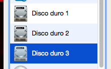

# SERVIDORES WEB DE ALTAS PRESTACIONES


## Práctica 6


### **Hugo Maldonado Cózar**

# <a></a>

Después de la configuración de la práctica 5 y la instalación y configuración de la nueva máquina que actuará como servidor de ficheros tenemos el siguiente esquema:

|        Nombre         |      IP        |
|:---------------------:|:--------------:|
| Ubuntu Server SWAP 1  |  10.211.55.9   |
| Ubuntu Server SWAP 2  |  10.211.55.10  |
| Ubuntu Server SWAP LB |  10.211.55.11  |
| Ubuntu Server SWAP FW |  10.211.55.12  |
| Ubuntu Server SWAP FS |  10.211.55.13  |


## Configuración RAID 1 para la máquina servidora de ficheros

Lo primero que hacemos es crear los discos e insertarlos como unidades en caliente en nuestra máquina servidora de ficheros. Ambos del mismo tipo y de la misma capacidad:



Una vez arrancada la máquina, podemos comprobar el correcto funcionamiento de los 3 discos duros:

```
hugomaldonado@ubuntu-server-swap-fs:~$ sudo fdisk -l
[sudo] password for hugomaldonado: 
Disk /dev/sda: 64 GiB, 68719476736 bytes, 134217728 sectors
Units: sectors of 1 * 512 = 512 bytes
Sector size (logical/physical): 512 bytes / 4096 bytes
I/O size (minimum/optimal): 4096 bytes / 4096 bytes
Disklabel type: dos
Disk identifier: 0xcb6311f5

Disposit.  Inicio     Start     Final  Sectores  Size Id Tipo
/dev/sda1  *           2048 132120575 132118528   63G 83 Linux
/dev/sda2         132122622 134215679   2093058 1022M  5 Extendida
/dev/sda5         132122624 134215679   2093056 1022M 82 Linux swap / Solaris

Partition 2 does not start on physical sector boundary.


Disk /dev/sdb: 10 GiB, 10737418240 bytes, 20971520 sectors
Units: sectors of 1 * 512 = 512 bytes
Sector size (logical/physical): 512 bytes / 4096 bytes
I/O size (minimum/optimal): 4096 bytes / 4096 bytes


Disk /dev/sdc: 10 GiB, 10737418240 bytes, 20971520 sectors
Units: sectors of 1 * 512 = 512 bytes
Sector size (logical/physical): 512 bytes / 4096 bytes
I/O size (minimum/optimal): 4096 bytes / 4096 bytes
```

Ahora vamos a proceder a crear el sistema `RAID 1`:

```
hugomaldonado@ubuntu-server-swap-fs:~$ sudo mdadm -C /dev/md0 --level=raid1 --raid-devices=2 /dev/sdb /dev/sdc
mdadm: Note: this array has metadata at the start and
    may not be suitable as a boot device.  If you plan to
    store '/boot' on this device please ensure that
    your boot-loader understands md/v1.x metadata, or use
    --metadata=0.90
Continue creating array? y
mdadm: Defaulting to version 1.2 metadata
mdadm: array /dev/md0 started.
```

Vamos a comprobar el estado:

```
hugomaldonado@ubuntu-server-swap-fs:~$ sudo mdadm --detail /dev/md0 
/dev/md0:
        Version : 1.2
  Creation Time : Wed May  3 18:40:18 2017
     Raid Level : raid1
     Array Size : 10477568 (9.99 GiB 10.73 GB)
  Used Dev Size : 10477568 (9.99 GiB 10.73 GB)
   Raid Devices : 2
  Total Devices : 2
    Persistence : Superblock is persistent

    Update Time : Wed May  3 18:42:21 2017
          State : clean 
 Active Devices : 2
Working Devices : 2
 Failed Devices : 0
  Spare Devices : 0

           Name : ubuntu-server-swap-fs:0  (local to host ubuntu-server-swap-fs)
           UUID : 6f9c8176:f3a437c2:8b1079cb:7ae9ba87
         Events : 19

    Number   Major   Minor   RaidDevice State
       0       8       16        0      active sync   /dev/sdb
       1       8       32        1      active sync   /dev/sdc

```

Como podemos ver, se ha creado correctamente.

Una vez creado el sistema `RAID`, vamos a darle formato:

```
hugomaldonado@ubuntu-server-swap-fs:~$ sudo mkfs /dev/md0 
mke2fs 1.43.3 (04-Sep-2016)
Descartando los bloques del dispositivo: hecho                            
Se está creando un sistema de ficheros con 2619392 bloques de 4k y 655360 nodos-i
UUID del sistema de ficheros: a9a91873-c901-4d91-ac37-1d00916e009c
Respaldo del superbloque guardado en los bloques: 
	32768, 98304, 163840, 229376, 294912, 819200, 884736, 1605632

Reservando las tablas de grupo: hecho                            
Escribiendo las tablas de nodos-i: hecho                            
Escribiendo superbloques y la información contable del sistema de archivos: hecho
```

Ahora vamos a crear el punto de montaje donde se montará el sistema `RAID`:

```
hugomaldonado@ubuntu-server-swap-fs:~$ sudo mkdir /dat

hugomaldonado@ubuntu-server-swap-fs:~$ sudo mount /dev/md0 /dat/
```

Podemos comprobar la correcta finalización del proceso:

```
hugomaldonado@ubuntu-server-swap-fs:~$ sudo mount
...
/dev/md0 on /dat type ext2 (rw,relatime,block_validity,barrier,user_xattr,acl)

hugomaldonado@ubuntu-server-swap-fs:~$ ls /dat/
lost+found
```

Por lo que vemos que se puede acceder al directorio y está correctamente montado.

Vamos a darle los permisos a nuestro usuario para que pueda escribir en dicha ruta:

```
hugomaldonado@ubuntu-server-swap-fs:~$ sudo chown -R hugomaldonado /dat/
```

Y ahora vamos a configurar que se monte el sistema `RAID` con el inicio del sistema. Primero vamos a obtener el identificador único del sistema `RAID`:

```
hugomaldonado@ubuntu-server-swap-fs:~$ ls -l /dev/disk/by-uuid/
total 0
lrwxrwxrwx 1 root root 10 may  3 18:34 3c48c9a7-e426-4643-86e6-c4f35e02e9b0 -> ../../sda1
lrwxrwxrwx 1 root root  9 may  3 18:41 a9a91873-c901-4d91-ac37-1d00916e009c -> ../../md0
lrwxrwxrwx 1 root root 10 may  3 18:34 bac68247-1e92-4973-8e51-24b864b2f7c4 -> ../../sda5
```

Y ahora modificamos el fichero `/etc/fstab` para que se ejecute la orden al inicio, añadiendo la siguiente orden:

```
UUID=a9a91873-c901-4d91-ac37-1d00916e009c /dat ext2 defaults 0 0
```

Ahora, aunque se reinicie el sistema, ya montaría automáticamente el sistema `RAID` que acabamos de crear y configurar.

Ahora vamos a comprobar el comportamiento del sistema `RAID`.

Lo primero, vamos a crear un fichero de prueba:

```
hugomaldonado@ubuntu-server-swap-fs:/dat$ echo "EJEMPLO" > ejemplo 

hugomaldonado@ubuntu-server-swap-fs:/dat$ ls
ejemplo  lost+found

hugomaldonado@ubuntu-server-swap-fs:/dat$ cat ejemplo 
EJEMPLO
```

Ahora, mediante el uso de la herramienta `mdadm` vamos a simular un fallo en el disco duro y posteriormente a "retirarlo en caliente" para comprobar si sigue accesible el fichero recién creado:

```
hugomaldonado@ubuntu-server-swap-fs:/$ sudo mdadm --manage --set-faulty /dev/md127 /dev/sdb
mdadm: set /dev/sdb faulty in /dev/md127

hugomaldonado@ubuntu-server-swap-fs:/$ sudo mdadm --manage --remove /dev/md127 /dev/sdb
mdadm: hot removed /dev/sdb from /dev/md127

hugomaldonado@ubuntu-server-swap-fs:/$ sudo mdadm --detail /dev/md127 
/dev/md127:
        Version : 1.2
  Creation Time : Wed May  3 18:40:18 2017
     Raid Level : raid1
     Array Size : 10477568 (9.99 GiB 10.73 GB)
  Used Dev Size : 10477568 (9.99 GiB 10.73 GB)
   Raid Devices : 2
  Total Devices : 1
    Persistence : Superblock is persistent

    Update Time : Wed May  3 18:55:25 2017
          State : clean, degraded 
 Active Devices : 1
Working Devices : 1
 Failed Devices : 0
  Spare Devices : 0

           Name : ubuntu-server-swap-fs:0  (local to host ubuntu-server-swap-fs)
           UUID : 6f9c8176:f3a437c2:8b1079cb:7ae9ba87
         Events : 24

    Number   Major   Minor   RaidDevice State
       -       0        0        0      removed
       1       8       32        1      active sync   /dev/sdc
```

Como podemos ver en los detalles, ahora sólo queda un disco conectado al sistema `RAID`.

Vamos a comprobar si el fichero anterior sigue accesible:

```
hugomaldonado@ubuntu-server-swap-fs:/$ cd /dat/

hugomaldonado@ubuntu-server-swap-fs:/dat$ ls
ejemplo  lost+found

hugomaldonado@ubuntu-server-swap-fs:/dat$ cat ejemplo 
EJEMPLO
```

Como podemos observar, el fichero sigue perfectamente accesible, por lo que nuestro sistema `RAID` está funcionando correctamente.

Para dejarlo en el estado ideal, vamos a volver a conectar el disco que anteriormente hemos retirado:

```
hugomaldonado@ubuntu-server-swap-fs:/dat$ sudo mdadm --manage --add /dev/md127 /dev/sdb
mdadm: added /dev/sdb

hugomaldonado@ubuntu-server-swap-fs:/dat$ sudo mdadm --detail /dev/md127 
/dev/md127:
        Version : 1.2
  Creation Time : Wed May  3 18:40:18 2017
     Raid Level : raid1
     Array Size : 10477568 (9.99 GiB 10.73 GB)
  Used Dev Size : 10477568 (9.99 GiB 10.73 GB)
   Raid Devices : 2
  Total Devices : 2
    Persistence : Superblock is persistent

    Update Time : Wed May  3 18:58:18 2017
          State : clean, degraded, recovering 
 Active Devices : 1
Working Devices : 2
 Failed Devices : 0
  Spare Devices : 1

 Rebuild Status : 7% complete

           Name : ubuntu-server-swap-fs:0  (local to host ubuntu-server-swap-fs)
           UUID : 6f9c8176:f3a437c2:8b1079cb:7ae9ba87
         Events : 27

    Number   Major   Minor   RaidDevice State
       2       8       16        0      spare rebuilding   /dev/sdb
       1       8       32        1      active sync   /dev/sdc
```

Y podemos ver cómo ya está conectado al sistema `RAID` y sincronizando de nuevo el disco anteriormente extraido.

## Configuración de servidor NFS para las máquinas de la granja que contienen la aplicación

Una vez que ya tenemos montado el sistema `RAID` vamos a configurar la máquina como un servidor `NFS` para el resto de las máquinas de nuestra granja.

Lo primero que tenemos que hacer es instalar las herramientas necesarias.

El paquete que nos permite compartir directorios NFS se llama `nfs-kernel-server`. Además, necesitaremos el paquete `nfs-common`, que contiene los programas que nos permitirán usar `NFS`, tanto en el lado cliente como en el lado servidor. Por último, necesitaremos el paquete `rpcbind`, un servicio que convierte los identificadores de programa `RPC` (Remote Procedure Call) en direcciones universales.

```
$ sudo apt-get install nfs-kernel-server nfs-common rpcbind
```

Una vez reiniciado, vamos a proceder a la configuración del servidor `NFS`.

Lo primero que vamos a hacer es crear la carpeta que vamos a querer compartir:

```
hugomaldonado@ubuntu-server-swap-fs:~$ mkdir /dat/nfs_shared

hugomaldonado@ubuntu-server-swap-fs:~$ ls /dat/
ejemplo  lost+found  nfs_shared
```

Ahora vamos a cambiar el nombre del usuario y grupo propietarios de la carpeta, para que no sean propiedad de nadie, y los permisos de acceso, para que todos los usuarios dispongan de todos los permisos sobre ella:

```
hugomaldonado@ubuntu-server-swap-fs:~$ sudo chown nobody:nogroup /dat/nfs_shared/

hugomaldonado@ubuntu-server-swap-fs:~$ sudo chmod -R 777 /dat/nfs_shared/
```

Ahora vamos a exportar el contenido de las carpetas para que esté disponible para los clientes. Para ello, modificamos el archivo `/etc/exports` y añadimos la siguiente línea:

```
/dat/nfs_shared/ 10.211.55.9(rw) 10.211.55.10(rw)  
```

Y reiniciamos el servicio:

```
hugomaldonado@ubuntu-server-swap-fs:~$ sudo service nfs-kernel-server restart
```

Ahora vamos a ir a alguna de las dos máquinas finales a las que le hemos permitido el acceso y vamos a instalar las herramientas y a configurarlas.

Necesita las mismas herramientas (salvo el server) para poder funcionar:

```
hugomaldonado@ubuntu-server-swap-1:~$ sudo apt-get install nfs-common rpcbind
```

Ahora vamos a crear el punto de montaje donde se montará el servidor `NFS`, asignarle permisos y a montarlo:

```
hugomaldonado@ubuntu-server-swap-1:~$ mkdir nfs_shared

hugomaldonado@ubuntu-server-swap-1:~$ ls
nfs_shared

hugomaldonado@ubuntu-server-swap-1:~$ chmod -R 777 nfs_shared/

hugomaldonado@ubuntu-server-swap-1:~$ sudo mount 10.211.55.13:/dat/nfs_shared nfs_shared/
```

Vamos a comprobar si se ha montado con éxito:

**Máquina 1** 

```
hugomaldonado@ubuntu-server-swap-1:~$ ls nfs_shared/
ejemplo

hugomaldonado@ubuntu-server-swap-1:~$ cat nfs_shared/ejemplo 
EJEMPLO
```

Podemos observar como hemos podido acceder correctamente al fichero creado anteriormente en la carpeta que hemos compartido mediante el servidor `NFS`.

Ahora vamos a crear un fichero en esta máquina y comprobar si está accesible en la máquina servidora `NFS`:

```
hugomaldonado@ubuntu-server-swap-1:~$ echo "EJEMPLO MÁQUINA 1" > nfs_shared/ejemplo2

hugomaldonado@ubuntu-server-swap-1:~$ ls nfs_shared/
ejemplo  ejemplo2

hugomaldonado@ubuntu-server-swap-1:~$ cat nfs_shared/ejemplo2 
EJEMPLO MÁQUINA 1

hugomaldonado@ubuntu-server-swap-fs:~$ ls /dat/nfs_shared/
ejemplo  ejemplo2

hugomaldonado@ubuntu-server-swap-fs:~$ cat /dat/nfs_shared/ejemplo2
EJEMPLO MÁQUINA 1
```

Como podemos observar, se puede acceder al nuevo fichero, por lo que la compartición y sincronización está funcionando perfectamente.

Sólo nos falta hacer que se monte esta carpeta compartida en el arranque del sistema, tal y como hicimos con el sistema `RAID`:

En las máquinas 1 y 2 modificamos el archivo `/etc/fstab` y añadimos la siguiente línea:

```
10.211.55.13:/dat/nfs_shared /home/hugomaldonado/nfs_shared/ nfs auto,noatime,nolock,bg,nfsvers=3,intr,tcp,actimeo=1800 0 0
```

Y así, cada vez que el sistema se arranque, se montará dicha carpeta compartida en las máquinas 1 y 2 y tendrán los datos compartidos accesibles.